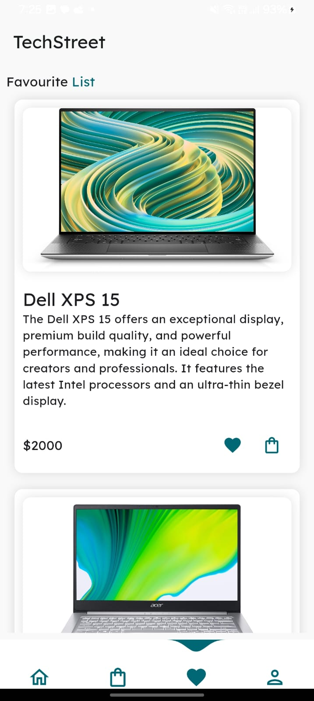

# Tech Street - E-Commerce App

Welcome to **Tech Street**, an e-commerce Flutter application built using the feature-first approach and Bloc for state management.

## Features

- **HomePage**: Discover the latest products and deals.
- **ProductInfo Page**: Get detailed information about products.
- **Favourites Page**: Save and manage your favorite items.
- **Cart Page**: View and manage items in your cart.

## Core Folder

The **core** folder contains app-wide utilities, including:

- **App Theme**: Centralized theme management for the entire app.
- **Data Models**: Models used throughout the app to maintain consistency.

### Home Screen

### Favourite Screen

### Cart Screen

### Product Info

## Dependencies

This project relies on the following Flutter packages:

- `google_fonts: ^6.2.1`: For using Google Fonts in your app.
- `water_drop_nav_bar: ^2.2.2`: A customizable bottom navigation bar with a water drop effect.
- `carousel_slider: ^4.2.1`: For creating image carousels and sliders.
- `flutter_bloc: ^8.1.6`: For implementing the Bloc pattern for state management.
